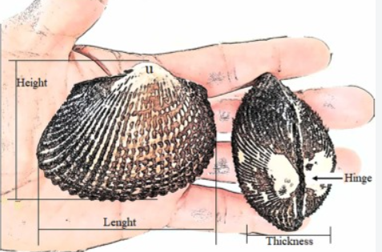

# Intro to ggplot and pipes

### 01 Set up the working environment

```{r message = FALSE, warning = FALSE}
# Run the setup script containing package restoration, helper functions, etc.
source(here::here("scripts", "01-setup.R"))

# Pull changes from the online repository into this local project folder.
# This is especially important when collaborating on the same project.
system2("git",c("-C", here::here(), "pull"))

# show which package namespaces are loaded to memory with library()
search()

# authenticate your @student.rug.nl google account
gsheets_auth()
```

## 02 Introduction to the data

We will work with an online metadatabase (a database of databases) of the Schiermonnikoog transect
study, that you will collect additional data for next week in the field.
Here is an overview of the metadatabase. 
https://docs.google.com/spreadsheets/d/1cZSCO03Z9rHPIPeDRMG2zZN7EKpL3PeWaTxHTOgB4G8

In this example, we work with measurements of cockles (a bivalve mollusc) on their width and length. 
The data are in the database epibenthos
https://docs.google.com/spreadsheets/d/1E1vUWAHhse7fhjBf94Kiog3Rsj7IkMuFtP-BTQX2oI8
From this database we will mainly work with the table FactCocklesSize 
See the documentation of the different variables in the table MetVariables in the same database

What is length and thickness of a cockle? The length is the distance from the tip of the shell to the hinge, and the thickness is the distance from one side of the shell to the other side. In addition there is also the height, from the hinge to the top of the shell, but we will not use that in our analysis.



## 03 Read the data table from the Google sheets database

We again use the function read_gsdb() from our file 01-setup.R to read the data from the online database.
```{r}
# For this script, we do not read the whole database, but only a specific sheet, and make it a separate tibble directly (so not a list of tibbles). Note that we do not assign something, each sheet is automatically assigned to a tibble with the same name as the sheet name in the database.
read_gsdb("https://docs.google.com/spreadsheets/d/1E1vUWAHhse7fhjBf94Kiog3Rsj7IkMuFtP-BTQX2oI8", sheets = "FactCockleSize", separate = TRUE)

print(FactCockleSize)  # show the contents of the tibble
names(FactCockleSize)  # show variable names
str(FactCockleSize)    # show structure of the tibble

# explore some aspects of the dataset
# show all values for the variable length, using the pipe operator |>
FactCockleSize |> 
  dplyr::select(Length_mm)  # 

# show a specific value
FactCockleSize[5,7] #  values for length (observation 5, column 7)
# but also better with a pipe, more control over which row, which column, and which variable name
FactCockleSize |> 
  dplyr::filter(CockleObs_ID==5) |>
  dplyr::select(Length_mm)   # this is the preferred way!

# show how many records (rows) are in the dataset so far (individuals cockles measured)
nrow(FactCockleSize) # number of records (rows)
```

Plot with ggplot the relation between cockle thickness and length, showing each year of measurement with a different color, and
add a regression line through all the years

```{r}
ggplot2::ggplot(data=FactCockleSize,
                mapping=aes(x=Length_mm,y=Thickness_mm)) +
                geom_point(size=2) +
                xlab("cockle length (mm)") +
                ylab("cockle width (mm)")

# you directly see that there is a strange outlier, a cockle 16 m thick!
# find this outlier, cockles can clearly not be thicker than 10 cm (100 mm) 469
FactCockleSize |>  dplyr::filter(Thickness_mm>100) 

FactCockleSize2 <- FactCockleSize |>
  dplyr::filter(CockleObs_ID!=1531 & CockleObs_ID!=469)  |> # remove this outlier
  dplyr::mutate(year=factor(Year)) # make year a factor
FactCockleSize2

ggplot2::ggplot(data=FactCockleSize2,
                mapping=aes(x=Length_mm,y=Thickness_mm)) +
                geom_point(size=2) +
                xlab("cockle length (mm)") +
                ylab("cockle thickness (mm)")
# find that other outlier
FactCockleSize |>  dplyr::filter(Thickness_mm>10, Length_mm<5) 
# add also this outlier CockleObs_ID 469 to the previous  filter, as that one is also not possible, a cockle cannot be 4 mm long and 10 mm thick, that is not a cockle but a piece of shell. So we remove that one too.

```

Further explore the plot with a linear regression line through all the data

```{r}
ggplot2::ggplot(data=FactCockleSize2, mapping=aes(x=Length_mm,y=Thickness_mm)) +
                geom_point(size=2) +
                xlab("cockle length (mm)") +
                ylab("cockle thickness (mm)") +
                geom_smooth(method='lm')

# show the model coefficients
model_lm<-lm(Thickness_mm~Length_mm, data=FactCockleSize2)
summary(model_lm)
```

Make same plot again but now showing a separate regression line per year

```{r}
# color the points by year, but plot one regression line
ggplot2::ggplot(data=FactCockleSize2,
                mapping=aes(x=Length_mm,y=Thickness_mm)) +
  geom_point(mapping=aes(col=factor(Year)), size=2) +
  xlab("cockle length(mm)") +
  ylab("cockle width (mm)") +
  geom_smooth(method='lm')

# as I like the figure, I will save it as png file, so I can use it in my report
ggsave(filename = here::here("figures/script05", "fig01.png"), width = 12, height = 8, units = "cm", dpi = 300)

```

Make a panel plot where with each year is shown as a separate graph

```{r}
ggplot2::ggplot(data=drop_na(FactCockleSize2),  # drop rows with NA (missing values)
                mapping=aes(x=Length_mm,y=Thickness_mm, group=Year)) +
  geom_point(size=2) +
  xlab("cockle length(mm)") +
  ylab("cockle width (mm)") +
  geom_smooth(method='lm') +
  facet_wrap(~year)
```

We conclude from this that: \* there were two important outliers in the
dataset that were removed after visual inspection \* the regression
between length and width is about the same for every year, we safely can
use only length as a proxy for the biomass of an individual cockle
